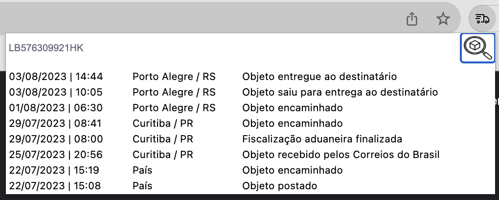

<strong>Extensão para chrome para rastrar suas encomendas:</strong>  

<strong>EM BREVE PARA DOWNLOAD PELA LOJA DE EXTENSÕES DO CHROME</strong>  

1. Caso adicione a extensão e ela não apareca, entre nas extensões:  
 
 
2. Procure pela extensão Chrome Track e clique no alfinete:  
 
 
3. Depois disso a extensão vai estar no fácil acesso, basta clicar no ícone, digitar seu código e clicar na lupa para pesquisar:  
 
 
4. Em seguida os dados do seu rastreio vão aparecer abaixo.
 
